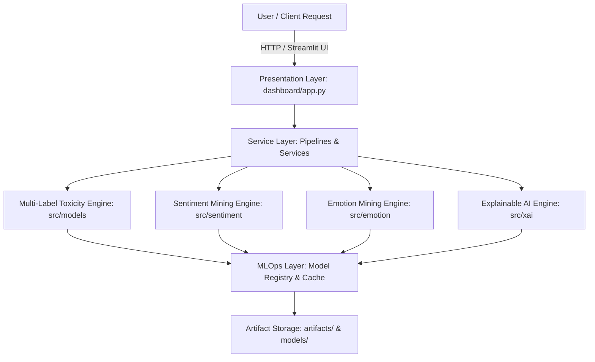

# Enterprise System Architecture (Step 153)

## 1. High-Level Component Diagram

---

## 2. Component Layer Responsibilities

### 2.1 Presentation Layer (`dashboard/`)
Multi-page Streamlit dashboard (`1_Home`, `2_EDA`, `3_Toxicity`, `4_Sentiment`, `5_Emotion`, `6_XAI`, `7_Model_Performance`, `8_Downloads`).

### 2.2 Domain Service Layer (`src/sentiment/`, `src/emotion/`, `src/xai/`)
Encapsulates business logic, rule-based lexicons (NRC, VADER), and transformer models.

### 2.3 Machine Learning Layer (`src/models/`, `src/features/`, `src/preprocessing/`)
Feature extraction (TF-IDF, embeddings) and 12-model inference engines (scikit-learn, XGBoost, BiLSTM, DistilBERT).

### 2.4 Infrastructure & MLOps Layer (`src/mlops/`)
Configuration loaders (`config.yaml`), structured JSON loggers (`app.log`), health probes (`HealthChecker`), and model registries (`registry.json`).
