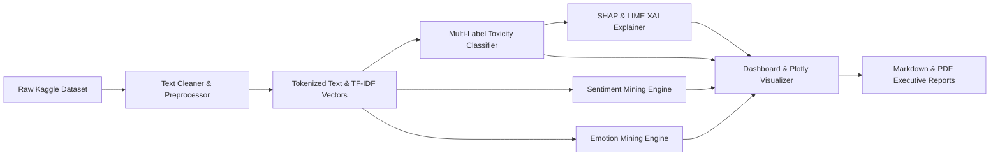

# End-to-End Data Flow Specification (Step 154)

## 1. End-to-End Data Flow Pipeline

---

## 2. Detailed Data Transformation Steps

1. **Ingestion**: Raw text input read from single form input or batch CSV file.
2. **Preprocessing**: Lowercasing, URL removal, contraction expansion, lemmatization via `src/preprocessing/text_cleaner.py`.
3. **Feature Extraction**: Vocabulary lookup and TF-IDF transformation via `src/features/tfidf_extractor.py`.
4. **Inference**: Parallel evaluation across multi-label toxicity, 3-class sentiment, and 7-class emotion engines.
5. **Explanation**: Computation of SHAP shapley values and LIME local linear surrogate models.
6. **Rendering**: Dynamic chart generation via Plotly and Streamlit.
